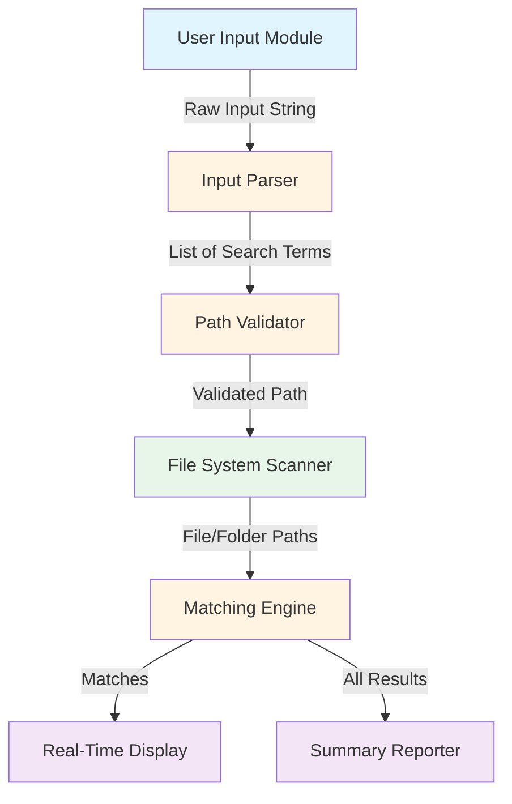

# Design Document: Text Search Capability

## Overview

### Purpose

This design document specifies the technical approach for expanding the `procurar_itens.ps1` PowerShell script from number-only search to arbitrary text search. The enhancement will allow users to search for any text string (words, phrases, special characters) in file and folder titles while maintaining the script's current performance characteristics and user experience.

### Scope

**In Scope:**
- Modification of input parsing to accept any text string
- Removal of numeric-only validation logic
- Implementation of case-insensitive text matching
- Safe handling of special characters in search terms
- Updates to user interface messages to reflect text search capability
- Preservation of existing performance optimizations (`cmd.exe /c "dir /s /b"`)
- Maintenance of real-time result display and progress indicators

**Out of Scope:**
- Regular expression pattern matching
- File content searching (only titles/names are searched)
- Extension-based filtering
- Recursive directory structure modifications
- Multi-threaded or parallel processing
- GUI interface development

### Key Design Decisions

1. **String Containment vs Pattern Matching**: Use `.Contains()` method for literal string matching rather than regex to avoid special character interpretation issues and maintain simplicity.

2. **Case-Insensitive Matching**: Implement case-insensitive comparison to improve user experience and match common search expectations.

3. **Preserve `cmd.exe` Performance**: Continue using native Windows `dir` command for file system traversal as it significantly outperforms PowerShell's `Get-ChildItem` on large volumes.

4. **Backward Compatibility**: Maintain the same input format (comma or space-separated terms) so existing user workflows remain valid.

5. **Minimal Code Changes**: Modify only the validation and matching logic to reduce risk and maintain code stability.

## Architecture

### High-Level Architecture

The script follows a linear pipeline architecture:

```
[User Input] → [Input Parsing] → [Path Validation] → [File System Traversal] → [Matching Engine] → [Results Display]
```

### Component Interaction



### Data Flow

1. **Input Phase**: User provides comma/space-separated search terms and target path
2. **Parsing Phase**: Input string is split into individual search terms, trimmed, and deduplicated
3. **Validation Phase**: Target path existence is verified
4. **Scanning Phase**: `cmd.exe dir /s /b` enumerates all files and folders
5. **Matching Phase**: Each item's title is compared against all search terms (case-insensitive)
6. **Display Phase**: Matches are displayed immediately; summary is shown at completion

## Components and Interfaces

### 1. Input Parser Component

**Responsibility**: Parse user input into a list of search terms

**Interface**:
```powershell
Input: $input_string (String)
Output: $search_terms (Array of Strings)
```

**Behavior**:
- Split input by comma or space: `-split '[, ]+'`
- Remove empty entries: `Where-Object { -not [string]::IsNullOrWhiteSpace($_) }`
- Trim whitespace from each term: `ForEach-Object { $_.Trim() }`
- Remove duplicates: `Select-Object -Unique`
- Validate at least one term exists

**Changes from Current Implementation**:
- **Remove**: `Where-Object { $_ -match '^\d+$' }` (numeric validation)
- **Remove**: Error message for non-numeric input
- **Add**: Whitespace trimming for each term
- **Update**: Variable names from `$numeros` to `$termos`

### 2. Path Validator Component

**Responsibility**: Validate the search path exists and is accessible

**Interface**:
```powershell
Input: $source_path (String)
Output: $validated_path (String) or Exit
```

**Behavior**:
- Check path existence: `Test-Path -Path $source_path`
- Ensure trailing backslash for Windows compatibility
- Exit with error message if path is invalid

**Changes from Current Implementation**:
- No changes required (already functional)

### 3. File System Scanner Component

**Responsibility**: Enumerate all files and folders in the target path

**Interface**:
```powershell
Input: $source_path (String)
Output: Stream of file/folder paths (String)
```

**Behavior**:
- Execute: `cmd.exe /c "dir /s /b \"$source_path*\" 2>nul"`
- Stream results through pipeline
- Display progress indicator every 2000 items

**Changes from Current Implementation**:
- No changes required (already optimal)

### 4. Matching Engine Component

**Responsibility**: Determine if search terms are present in file/folder titles

**Interface**:
```powershell
Input: $file_path (String), $search_terms (Array of Strings)
Output: $matches (Hashtable: term → array of paths)
```

**Behavior**:
- Extract title: `[System.IO.Path]::GetFileNameWithoutExtension($file_path)`
- For each search term:
  - Perform case-insensitive containment check
  - Record match if found and not duplicate
  - Display real-time success message

**Changes from Current Implementation**:
- **Replace**: `$title_only.Contains($num)` with case-insensitive version
- **Add**: Case-insensitive comparison using `-like` or `.ToLower().Contains()`
- **Update**: Variable names from `$num` to `$termo`

**Implementation Options for Case-Insensitive Matching**:

Option A (Recommended):
```powershell
if ($title_only.ToLower().Contains($termo.ToLower())) { ... }
```

Option B:
```powershell
if ($title_only -like "*$termo*") { ... }
```

**Decision**: Use Option A for better performance and explicit control over case sensitivity.

### 5. Results Display Component

**Responsibility**: Show matches in real-time and provide final summary

**Interface**:
```powershell
Input: $matches (Hashtable), $total_items (Integer)
Output: Console output with color formatting
```

**Behavior**:
- Real-time: Display each match immediately with green success message
- Summary: Show total items scanned
- Summary: For each term, show count and success/failure status

**Changes from Current Implementation**:
- **Update**: All message text from "número" to "termo" or "texto"
- **Update**: Title from "Procurador de Itens por Número" to "Procurador de Itens por Texto"

## Data Models

### Search Term

```powershell
Type: String
Constraints:
  - Non-empty after trimming
  - Can contain any Unicode characters
  - Treated as literal string (not regex pattern)
```

### Search Results

```powershell
Type: Hashtable
Structure:
  Key: String (search term)
  Value: Array of Strings (file paths containing the term)

Example:
@{
    "projeto" = @("C:\Docs\projeto_2024.docx", "C:\Backup\projeto_final.pdf")
    "relatorio" = @("C:\Docs\relatorio_anual.xlsx")
}
```

### Progress State

```powershell
Type: Integer
Purpose: Track number of items processed for progress indicator
Increment: +1 per item
Display Trigger: Every 2000 items
```

## Correctness Properties

*A property is a characteristic or behavior that should hold true across all valid executions of a system—essentially, a formal statement about what the system should do. Properties serve as the bridge between human-readable specifications and machine-verifiable correctness guarantees.*

Before defining the correctness properties, I need to analyze the acceptance criteria to determine which are testable as properties.


### Property 1: Non-empty text input acceptance

*For any* non-empty string (containing letters, numbers, spaces, or special characters), the script SHALL accept it as valid input and proceed to the search phase without validation errors.

**Validates: Requirements 1.1, 1.2, 2.2, 2.3**

### Property 2: Multi-term parsing correctness

*For any* list of search terms separated by commas or spaces, the script SHALL correctly parse each individual term, removing duplicates and preserving the trimmed text of each unique term.

**Validates: Requirements 1.3**

### Property 3: Case-insensitive substring matching

*For any* search term and file title, if the term appears as a substring of the title (ignoring case differences), the script SHALL identify it as a match.

**Validates: Requirements 3.1, 3.2**

### Property 4: Extension exclusion from matching

*For any* file path with an extension, the script SHALL perform matching only against the filename portion without the extension, never matching against the extension itself.

**Validates: Requirements 3.3**

### Property 5: Unique match recording

*For any* search term and set of file paths, when matches are found, the script SHALL record each matching path exactly once in the results for that term, avoiding duplicates.

**Validates: Requirements 3.4, 3.5, 5.4**

### Property 6: Error resilience during traversal

*For any* error encountered during file system traversal (corrupted paths, access denied, invalid characters), the script SHALL handle the error gracefully and continue processing the remaining items without terminating.

**Validates: Requirements 4.3**

### Property 7: Mixed item type processing

*For any* directory structure containing both files and folders, the script SHALL process and match against both types in a single traversal.

**Validates: Requirements 4.4**

### Property 8: Real-time match display

*For any* match found during scanning, the script SHALL immediately display both the search term and the full file path to the console before continuing to the next item.

**Validates: Requirements 5.1, 5.2**

### Property 9: Summary completeness

*For any* set of search terms used in a search, the script SHALL display a summary entry for each term showing the count of matches found, regardless of whether the count is zero or positive.

**Validates: Requirements 6.2**

### Property 10: Conditional summary feedback

*For any* search term in the summary, the script SHALL display a success message (green) when matches were found, and a not-found message (red) when no matches were found.

**Validates: Requirements 6.3, 6.4**

### Property 11: Literal special character matching

*For any* search term containing regex special characters (such as `.`, `*`, `[`, `]`, `(`, `)`, `?`, `+`, `|`), the script SHALL treat each character literally during matching, not as a regex pattern element.

**Validates: Requirements 8.1, 8.2**

### Property 12: Invalid path character tolerance

*For any* search term containing characters that are invalid in file paths (such as `<`, `>`, `|`, `:`, `"`), the script SHALL process the search without errors, even though such terms will never match valid file names.

**Validates: Requirements 8.4**

## Error Handling

### Input Validation Errors

**Error**: Empty or whitespace-only input
- **Detection**: Check if input string is null, empty, or contains only whitespace after trimming
- **Handling**: Display error message in red: "AVISO: Nenhum termo fornecido. Encerrando."
- **Recovery**: Exit script with error code

**Error**: No search terms after parsing
- **Detection**: After splitting and filtering, the resulting array is empty
- **Handling**: Display error message in red: "AVISO: Nenhum termo válido foi identificado. Encerrando."
- **Recovery**: Exit script with error code

### Path Validation Errors

**Error**: Invalid or inaccessible search path
- **Detection**: `Test-Path` returns false
- **Handling**: Display error message in red: "AVISO: O caminho '$source_path' não existe ou não está acessível."
- **Recovery**: Exit script with error code

### File System Traversal Errors

**Error**: Access denied to specific files/folders
- **Detection**: Exception during path processing in try-catch block
- **Handling**: Silently skip the item and continue processing
- **Recovery**: Continue with next item in traversal
- **Rationale**: Individual access errors should not stop the entire search

**Error**: Corrupted or invalid file paths
- **Detection**: Exception during `GetFileNameWithoutExtension` call
- **Handling**: Silently skip the item and continue processing
- **Recovery**: Continue with next item in traversal
- **Rationale**: Malformed paths should not crash the search

**Error**: `cmd.exe` execution failure
- **Detection**: No output from `dir` command or command fails
- **Handling**: Script will complete with zero items scanned
- **Recovery**: Display summary showing no results found
- **Rationale**: Rare scenario; user will see zero items scanned and investigate

### Runtime Errors

**Error**: Out of memory (extremely large result sets)
- **Detection**: PowerShell throws OutOfMemoryException
- **Handling**: No explicit handling (PowerShell will terminate)
- **Recovery**: None (user must reduce search scope)
- **Mitigation**: Real-time display ensures partial results are visible before crash

**Error**: Console output buffer overflow
- **Detection**: Too many real-time messages
- **Handling**: PowerShell handles automatically (may truncate early output)
- **Recovery**: Summary will still be complete
- **Mitigation**: Progress indicators are throttled to every 2000 items

## Testing Strategy

### Overview

This feature will be tested using a combination of unit tests and property-based tests. The PowerShell script's functional core (parsing, matching, result aggregation) is well-suited for property-based testing, while UI output and integration with the file system are better suited for example-based tests.

### Property-Based Testing Approach

**Framework**: Pester with custom property test helpers (PowerShell's native testing framework)

**Configuration**: Minimum 100 iterations per property test

**Test Structure**: Each property test will:
1. Generate random inputs (search terms, file paths, directory structures)
2. Execute the relevant script function or component
3. Assert the property holds for all generated inputs
4. Tag the test with the design property reference

### Unit Testing Approach

**Framework**: Pester

**Focus Areas**:
- Specific examples of input parsing (empty input, single term, multiple terms)
- Edge cases (whitespace handling, special characters)
- Integration with `cmd.exe` (mocked for unit tests)
- Console output formatting (color codes, message structure)
- Progress indicator timing (every 2000 items)

### Test Categories

#### 1. Input Parsing Tests

**Property Tests**:
- Property 1: Non-empty text input acceptance (100 iterations)
  - Generate random non-empty strings with various character types
  - Verify acceptance without validation errors
  - **Tag**: `Feature: text-search-capability, Property 1: Non-empty text input acceptance`

- Property 2: Multi-term parsing correctness (100 iterations)
  - Generate random lists of terms with comma/space separators
  - Verify correct parsing, deduplication, and trimming
  - **Tag**: `Feature: text-search-capability, Property 2: Multi-term parsing correctness`

**Unit Tests**:
- Empty input rejection (specific example)
- Whitespace-only input rejection (specific example)
- Single term parsing (specific example)
- Multiple terms with mixed separators (specific example)

#### 2. Matching Logic Tests

**Property Tests**:
- Property 3: Case-insensitive substring matching (100 iterations)
  - Generate random term/title pairs with various case combinations
  - Verify matches are found regardless of case
  - **Tag**: `Feature: text-search-capability, Property 3: Case-insensitive substring matching`

- Property 4: Extension exclusion from matching (100 iterations)
  - Generate file paths with various extensions
  - Verify matching only considers filename without extension
  - **Tag**: `Feature: text-search-capability, Property 4: Extension exclusion from matching`

- Property 11: Literal special character matching (100 iterations)
  - Generate terms with regex special characters
  - Verify literal matching (not pattern matching)
  - **Tag**: `Feature: text-search-capability, Property 11: Literal special character matching`

**Unit Tests**:
- Exact match example (term equals title)
- Partial match example (term is substring of title)
- No match example (term not in title)
- Special character literal matching examples (`.`, `*`, `[`, `]`)

#### 3. Result Management Tests

**Property Tests**:
- Property 5: Unique match recording (100 iterations)
  - Simulate multiple matches of same path
  - Verify each path recorded exactly once per term
  - **Tag**: `Feature: text-search-capability, Property 5: Unique match recording`

**Unit Tests**:
- Single match recording (specific example)
- Multiple matches for one term (specific example)
- Multiple terms matching same file (specific example)

#### 4. Error Handling Tests

**Property Tests**:
- Property 6: Error resilience during traversal (100 iterations)
  - Inject various errors (access denied, corrupted paths)
  - Verify script continues processing
  - **Tag**: `Feature: text-search-capability, Property 6: Error resilience during traversal`

- Property 12: Invalid path character tolerance (100 iterations)
  - Generate terms with invalid path characters
  - Verify no errors during processing
  - **Tag**: `Feature: text-search-capability, Property 12: Invalid path character tolerance`

**Unit Tests**:
- Access denied error handling (mocked)
- Corrupted path error handling (mocked)
- `GetFileNameWithoutExtension` exception handling (mocked)

#### 5. File System Integration Tests

**Property Tests**:
- Property 7: Mixed item type processing (100 iterations)
  - Create test directories with files and folders
  - Verify both types are processed
  - **Tag**: `Feature: text-search-capability, Property 7: Mixed item type processing`

**Unit Tests**:
- `cmd.exe dir` output parsing (specific examples)
- Progress indicator at 2000 items (specific example)
- Progress indicator at 4000 items (specific example)

#### 6. Output Display Tests

**Property Tests**:
- Property 8: Real-time match display (100 iterations)
  - Generate matches during simulated scan
  - Verify immediate console output for each match
  - **Tag**: `Feature: text-search-capability, Property 8: Real-time match display`

- Property 9: Summary completeness (100 iterations)
  - Generate various search term sets
  - Verify summary entry for each term
  - **Tag**: `Feature: text-search-capability, Property 9: Summary completeness`

- Property 10: Conditional summary feedback (100 iterations)
  - Generate scenarios with and without matches
  - Verify appropriate success/failure messages
  - **Tag**: `Feature: text-search-capability, Property 10: Conditional summary feedback`

**Unit Tests**:
- Real-time match message format (specific example)
- Summary header format (specific example)
- Success message format (specific example)
- Not-found message format (specific example)
- Color code verification (manual/visual)

#### 7. UI Message Tests

**Unit Tests** (Smoke Tests):
- Title message updated to reflect text search
- Input prompt updated to request text terms
- All messages use "termo" instead of "número"
- Color scheme consistency (Cyan, Yellow, Green, Red)

### Test Data Generation Strategy

For property-based tests, we will generate:

**Search Terms**:
- Random strings of length 1-50
- Character sets: alphanumeric, spaces, special characters, Unicode
- Edge cases: single character, very long strings, all special characters

**File Paths**:
- Random directory structures (depth 1-5)
- Random filenames with various extensions
- Character sets: valid filename characters
- Edge cases: very long paths, paths near MAX_PATH limit

**File Titles**:
- Random strings matching filename constraints
- Various case combinations (lowercase, uppercase, mixed)
- With and without extensions

### Integration Testing

**Scope**: End-to-end testing with real file system

**Test Cases**:
1. Search in small directory (10 files) with known matches
2. Search in large directory (10,000+ files) for performance validation
3. Search with multiple terms, some matching, some not
4. Search in directory with access restrictions (mixed accessible/inaccessible)
5. Search with special characters in terms
6. Search with Unicode characters in terms and filenames

**Success Criteria**:
- All matches found correctly
- No false positives
- Performance comparable to current number-only search
- Progress indicators appear at expected intervals
- Summary accurately reflects results

### Manual Testing

**Test Cases**:
1. Visual verification of color scheme
2. Verification of message text updates (português)
3. User experience testing (input prompts, error messages)
4. Performance testing on network drives
5. Testing on different Windows versions (Windows 10, 11, Server)

### Test Coverage Goals

- **Unit Test Coverage**: 90%+ of parsing and matching logic
- **Property Test Coverage**: All 12 correctness properties
- **Integration Test Coverage**: All major user workflows
- **Edge Case Coverage**: All error handling paths

### Continuous Testing

**Pre-commit**: Run unit tests and fast property tests (10 iterations)
**CI Pipeline**: Run full property tests (100 iterations) and integration tests
**Release**: Run manual tests and performance benchmarks

## Implementation Notes

### Code Refactoring Required

1. **Variable Renaming**:
   - `$numeros_str` → `$termos_str`
   - `$numeros` → `$termos`
   - `$num` → `$termo`
   - `$encontrados` (keep, but update comments)

2. **Validation Logic Removal**:
   - Remove: `Where-Object { $_ -match '^\d+$' }`
   - Remove: Error message "Nenhum número válido foi identificado"

3. **Matching Logic Update**:
   - Replace: `$title_only.Contains($termo)`
   - With: `$title_only.ToLower().Contains($termo.ToLower())`

4. **Message Updates**:
   - Title: "Procurador de Itens por Texto no Título"
   - Prompt: "Digite os termos que deseja procurar (separados por vírgula ou espaço)"
   - Success: "SUCESSO! Encontrei o termo '$termo' neste título!"
   - Summary success: "SUCESSO: O termo '$termo' foi encontrado em $qdt item(ns)."
   - Summary failure: "NÃO ENCONTRADO: O termo '$termo' NÃO foi achado em lugar nenhum nesta pasta."
   - Info: "Este processo buscará os termos APENAS nos TÍTULOS dos arquivos e pastas."

### Performance Considerations

- **No Performance Degradation Expected**: The change from numeric to text matching does not affect the core performance bottleneck (file system traversal via `cmd.exe`)
- **Case Conversion Overhead**: `.ToLower()` calls add minimal overhead compared to I/O time
- **Memory Usage**: Unchanged (same data structures)

### Backward Compatibility

- **Input Format**: Existing numeric searches will continue to work (numbers are valid text)
- **Output Format**: Same structure, only message text changes
- **Behavior**: Numeric searches will now be case-insensitive (minor change, likely beneficial)

### Future Enhancements (Out of Scope)

- Regular expression pattern matching (optional mode)
- File content searching (not just titles)
- Parallel processing for faster searches
- Export results to CSV/JSON
- GUI interface
- Quoted string handling for preserving spaces
